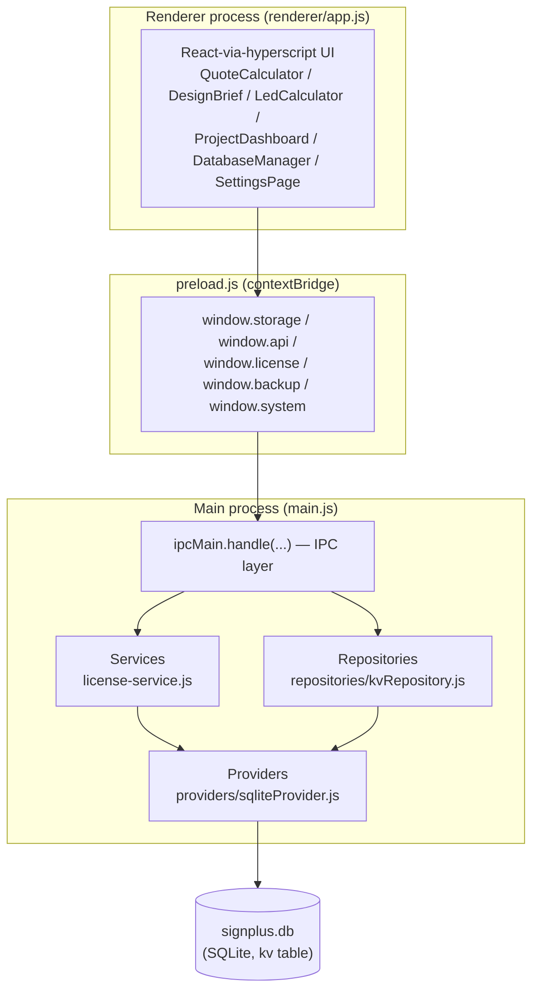
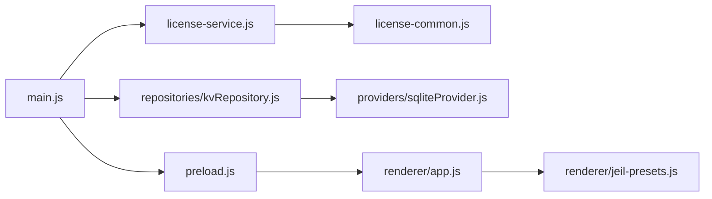
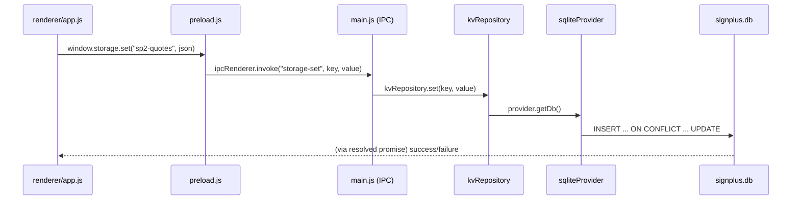
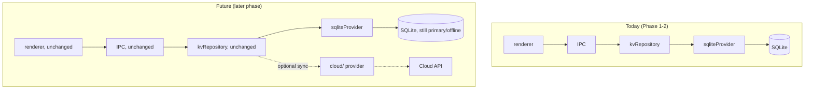

# Architecture

Signplus Suite is an Electron desktop app (Windows) for a Korean signage company. This document describes the current architecture and the Cloud-Ready direction it is being prepared for, per `00_PROJECT_VISION.md`'s principle that "business logic must be independent from storage" and "future NAS/Cloud support must require minimal code changes."

## Overall architecture



## Renderer / Main separation

- The renderer never touches the filesystem, SQLite, or Node APIs directly. It only calls the four `window.*` namespaces preload exposes, and those calls are the *entire* surface between UI and storage.
- Because the renderer only ever calls `window.storage.get(key)` / `set(key, value)` (generic KV) rather than anything SQLite-specific, the renderer is already backend-agnostic — swapping what's behind `storage-get`/`storage-set` in `main.js` requires zero renderer changes.
- All business/domain logic (margin calculation, LED module math, license expiry, PDF/Excel formatting) lives in the renderer or in dedicated main-process modules — never inside SQL or IPC plumbing.

## Module relationships



## Current local SQLite architecture

Storage is a single SQLite database (`better-sqlite3`) at `{userData}/signplus-suite-data/signplus.db`, containing one table:

```sql
CREATE TABLE IF NOT EXISTS kv (key TEXT PRIMARY KEY, value TEXT NOT NULL)
```

Every domain object (quotes, projects, clients, company info, vendor price books, settings) is stored as a JSON string under a string key (`sp2-quotes`, `sp2-projects`, `sp2-company`, `sp2-vendors`, `sp2-presets` / `sp2-presets-<vendorId>`, etc.) — there is no relational schema beyond this generic KV table. On first run, if `kv` is completely empty, any leftover per-key `.json` files from the pre-3.7.0 storage format are migrated in once and never read again.

This generic-KV shape is deliberate: it's what makes the repository/provider split below practical without a schema migration — a future backend only needs to support "get/set/list a JSON blob by string key," not a bespoke relational schema per feature.

## Repository pattern

`repositories/kvRepository.js` exports `createKvRepository(provider)`, exposing `get(key)`, `set(key, value)`, `getAll()`, `setMany(entries)`. It contains the same SQL/transaction logic that used to sit inline in `main.js`'s `storage-get`/`storage-set`/`backup-export`/`backup-import` handlers — extracted, not rewritten, so behavior is byte-for-byte identical.

A repository represents *what the app's data operations are* (get/set/list-all/bulk-set for the KV store), independent of *how* they're physically carried out. Nothing above the repository (IPC handlers, services, the renderer) needs to know or care whether the repository is backed by SQLite, a NAS share, or a cloud API.

## Provider pattern

`providers/sqliteProvider.js` exports `createSqliteProvider({ app })`, exposing `getStorageDir()` and `getDb()` — the connection/bootstrap layer (where is the data, how do we open it, one-time legacy migration). It is the *only* module that knows SQLite exists.

A future `providers/nasProvider.js` or `providers/cloudProvider.js` would implement the same shape (`getStorageDir`/`getDb`, or an equivalent accessor) and could be swapped in by changing one `require(...)` and one factory call in `main.js` — the repository layer above it, and everything above that, stays untouched.

## Service layer

`license-service.js` (`createLicenseService({ getStorageDir })`) is the existing precedent for this layer: it owns a business capability (serial validation, activation, expiry) end-to-end and is the only thing `main.js`'s license IPC handlers call. It already has an explicit extension point for a future online activation server (`tryOnlineActivate()`, currently a no-op that falls back to offline `checkSerial`).

The same shape applies to any future storage-related service: a `services/` module orchestrating one or more repositories for a specific capability (e.g. a future sync service coordinating a local repository and a cloud repository), while IPC handlers stay thin.

## IPC layer

`main.js`'s `ipcMain.handle(...)` calls are the boundary between the renderer and everything else. They are intentionally thin — parse input, delegate to a service or repository, catch/shape the error — never containing business logic or SQL themselves. This is what lets the renderer stay 100% unaware of what's on the other side of `window.storage`/`window.license`/etc.

## Data flow (example: saving a quote)



## Future Cloud/NAS architecture

Nothing in this section is implemented yet — no server connection, no auth, no schema change. It documents the extension points already scaffolded so a future phase can add a backend without touching the renderer or business logic:



- **Offline-first stays true**: SQLite remains the primary, always-available local database. A cloud/NAS provider is additive — a future sync layer, not a replacement.
- **`/cloud`** is reserved for future NAS/cloud-specific provider implementations and sync orchestration. It intentionally has no active code yet.
- Any future provider must implement the same interface `sqliteProvider` exposes today, so `kvRepository` (and everything above it) never changes.

## Folder structure

```
signplus-suite/
├── main.js              # Electron main process, IPC handlers (thin)
├── preload.js            # contextBridge — the only renderer↔main boundary
├── license-common.js      # serial format/validation (pure, no I/O)
├── license-service.js      # license service (existing precedent for services/)
├── services/              # business-capability orchestration (extension point)
├── repositories/           # data-shape interfaces, backend-agnostic
│   └── kvRepository.js
├── providers/              # backend connections — SQLite today, NAS/Cloud later
│   └── sqliteProvider.js
├── cloud/                  # reserved for future NAS/Cloud provider + sync code
├── renderer/
│   ├── app.js              # all UI + business logic (no bundler)
│   └── jeil-presets.js      # seed data for the default vendor's price book
├── vendor/                  # prebuilt React (no npm dependency for renderer)
└── docs/                    # this documentation set
```

## Future extension points

| Extension point | How to add it | What must NOT change |
|---|---|---|
| New backend (NAS) | Add `providers/nasProvider.js` implementing `getStorageDir`/`getDb` | `repositories/kvRepository.js`, IPC handlers, renderer |
| New backend (Cloud API) | Add `cloud/cloudProvider.js`, wire into a repository or new service | Same as above |
| Online license activation | Implement `tryOnlineActivate()` in `license-service.js` | `license-common.js` validation, IPC channel names |
| Sync between local and cloud | Add a `services/syncService.js` orchestrating two repositories | Existing single-repository call sites |
| New domain feature (e.g. Calendar, Attachments — see `02_ROADMAP.md` Phase 3) | New renderer component + new storage key, same `window.storage.get/set` pattern | Nothing — this is already how every existing feature is added |

## Known constraints (unchanged)

- Main-process file I/O is synchronous.
- No automated test suite for calculation logic or IPC handlers.
- No renderer build step — `renderer/app.js` is one large hand-written file.
